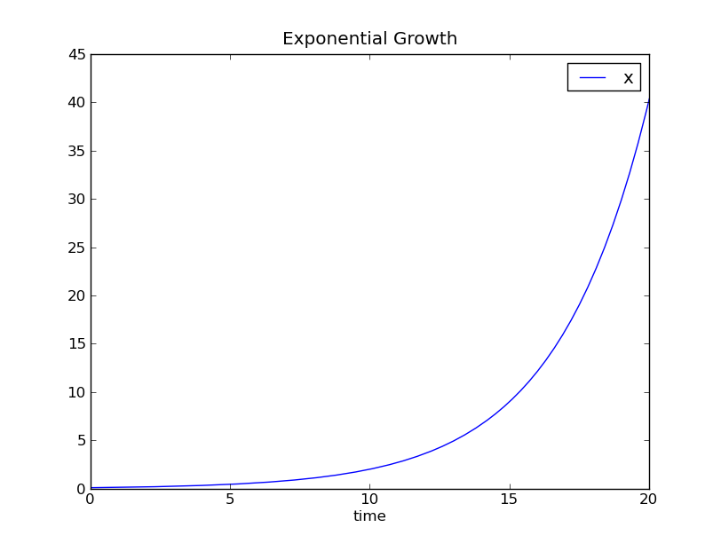
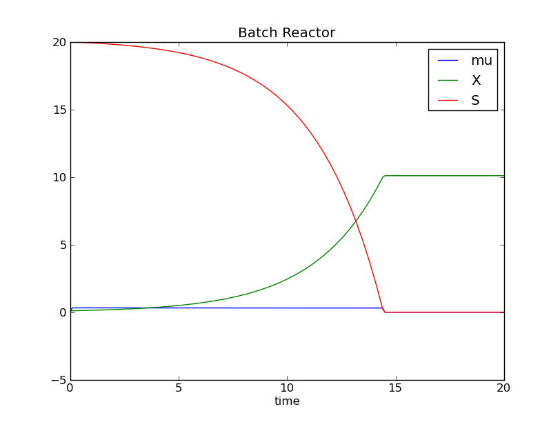

..  Copyright (C) 2010 - 2010 Eike Welk 

    License: GNU FDL

    Everyone is permitted to copy, distribute and/or modify this
    document under the terms of the GNU Free Documentation License,
    Version 1.3 or any later version published by the Free Software
    Foundation; with no Invariant Sections, no Front-Cover Texts and
    no Back-Cover Texts. A copy of the license is included in the
    file "GNU-Free-Documentation-License-1.3.txt"

.. Let all references go to the built in module. This shortens all references.
.. currentmodule:: __siml_builtin__

************************************
The Siml Tutorial - Bioreactors
************************************

The Siml programming language is a simple domain specific language to solve 
differential equations. The differential equation are solved numerically.
The compiler produces a program in the Python language, that performs the 
numerical computations.
The generated Python program can be used as a stand-alone program, 
or as a module of a more complex program.

This introduction should teach you enough of the Siml language
that you can write simple simulations yourself.
The text assumes that you have some experience in writing simple computer 
programs, and a basic knowledge of differential equations.

The examples are taken from the field of biotechnology.

Example 1: Exponential Growth
=============================

Under favorable conditions bacteria grow at a constant (and often fairly fast)
rate. If these favorable conditions can be maintained, the newly produced 
bacteria also grow at the same rate. This results in exponential growth of the 
bacterial biomass.   

Differential equation :eq:`biomass_exp` describes this behavior. The constant 
**µ** is the growth speed.

.. math::
    :label: biomass_exp

    {dx \over dt} = \mu \cdot X

With :math:`\mu = 0.3`, and the initial value :math:`x = 0.1`, one can 
compute a closed-form solution :eq:`biomass_exp_soln`. This exact solution
can be used to check the correctness of the numerical solution.

.. math::
    :label: biomass_exp_soln 

    x = 0.1 \cdot e^{0.3 \cdot time}

The listing below shows a Siml program that computes a numerical solution of 
differential equation :eq:`biomass_exp`.

.. literalinclude:: models/biological/exponential_growth.siml
    :language: siml
    :linenos:    

The Exponential Growth program.

The following sections discuss the program in detail:

Comments
--------

Comments start with a ``#`` character and extend to the end of the line.
The first line of the program contains a comment that covers the whole line.
In line three there is a comment that covers only part of the line.  

Whitespace
----------

In Siml whitespace is significant, exactly as in the 
`Python <http://docs.python.org/tutorial/>`_ language. 
Statements are grouped by indenting them to a common level.
Observe how the four lines starting with: ``data`` and ``func`` are all 
indented to the same column.
Also observe that the lines immediately following the ``func`` statements
also have the same indent.  

Object Oriented Language
------------------------

In Siml all simulations are objects [#like_java]_. They must have certain *main* methods,
that are invoked during the simulation:

* The **initialize** method is invoked once at the beginning of the simulation.
* The **dynamic** method contains the differential equations. It is invoked 
  repeatedly during the simulation.
* The **final** method is invoked at the end.

``class`` Statement
-------------------

.. literalinclude:: models/biological/exponential_growth.siml
    :lines: 2-6
    :language: siml

Lines 2-6 of the Exponential Growth program.

The ``class`` statement defines an object. The 
simulation object's name ``ExponentialGrowth`` can be freely chosen by the user.
The colon ``:`` after the name is mandatory. All statements in the body 
of the simulation object have to be indented to the same level.

``data`` Statement
------------------
   
.. literalinclude:: models/biological/exponential_growth.siml
    :lines: 3
    :language: siml

Line 3 of the Exponential Growth program.

Define the variable **x** as a floating point number.

The ``data`` statement defines attributes (variables, parameters and constants).
The ``data`` keyword is followed by the attribute's name (``x``),
a colon ``:``, and the type of attribute (``Float``).

In Siml attributes have to be defined before they can be used 
(differently to Python). 

================= ===========================================
Important built in types                              
-------------------------------------------------------------
Type              Description                              
================= ===========================================
\ :class:`Float`  Floating point number                    
                                                       
                  You will normally use only this type.    
                  All other types are only rarely useful.  

\ :class:`String` Sequence of characters                   
\ :class:`Bool`   Logical value                            
================= ===========================================

``func`` Statement 
------------------

.. literalinclude:: models/biological/exponential_growth.siml
    :lines: 5
    :language: siml

Line 5 of the Exponential Growth program.

Here the method ``initialize`` is defined.

The ``func`` keyword defines functions and methods [#member_functions]_.
It is followed by the method's name, then comes a parenthesized list of the 
method's arguments, followed by a colon (*:*). 

The first argument of a method must always be **this**, it has exactly the same
role as ``self`` in Python: It contains the object on which the 
method operates. Differently to Python you don't have to write ``this.x`` to
access the attribute **x** of the simulation object. Attributes that are 
accessible through the special argument ``this`` are looked up automatically.
  
All statements in the method's body must be indented to the same level.

``initialize`` method
---------------------

.. literalinclude:: models/biological/exponential_growth.siml
    :lines: 5-7 
    :language: siml

Lines 5-7 of the Exponential Growth program.

The ``initialize`` method is invoked once at the beginning of the simulation.

It first computes the *initial value* of the (state) variable **x**.

Then the built in function :func:`solution_parameters` is invoked.
It determines the *duration* of the simulation (20), and the *resolution* 
on the time axis (0.1). 
The simulation always starts at time=0.
Therefore the simulation's variables will be recorded 200 times.

``dynamic`` method
---------------------

.. literalinclude:: models/biological/exponential_growth.siml
    :lines: 9-10 
    :language: siml

Lines 9-10 of the Exponential Growth program.

The ``dynamic`` method contains the *differential equations*.
It is invoked many times during the simulation by the solver.

In this simulation, ``dynamic`` computes the *time derivative* of ``x``.

The expression ``$x`` denotes the *time derivative*. 
The dollar(``$``) operator is multi functional: it accesses the time derivative, 
and it also tells the compiler that a variable is a *state variable* 
[#dollar_operator]_. 

``final`` method
---------------------

.. literalinclude:: models/biological/exponential_growth.siml
    :lines: 12-14 
    :language: siml

Lines 12-14 of the Exponential Growth program.

The ``final`` method is invoked at the end of the simulation.

In this simulation proigram is creates a graph of the variable ``x`` versus
``time`` with the built in :func:`graph` function. 
Then it sends a short text to the standard output with the built in :func:`print`
function. The text contains the final values of ``x`` and ``time``. 

``compile`` statement
---------------------

.. literalinclude:: models/biological/exponential_growth.siml
    :lines: 17 
    :language: siml

Line 17 of the Exponential Growth program.

Tell the compiler to compile the object **ExponentialGrowth**.

The keyword ``compile`` is followed by the (class) name of the simulation 
object. There can be multiple compile statements in one file.

Running the Simulation
----------------------

The Exponential Growth program is available on the website, and in the 
``*.tar.gz`` and ``*.zip`` archives as :download:`models/biological/exponential_growth.siml`

The simulation program can be typed into any text editor. 
For details on editors see: :ref:`editor-usage-intro`.

If you have saved the Exponential Growth program under the name 
``exponential_growth.siml`` you can compile and run the program at once by typing 
the following into a shell window:

.. code-block:: bash

    $> simlc exponential_growth.siml -r all

When run, the simulation opens a window with a graph similar to the one below.
The graph matches the exact solution :eq:`biomass_exp_soln` 
(:math:`x = 0.1 \cdot e^{0.3 \cdot time}`) very well.

    Biomass concentration versus simulation time.

.. _intro-batch-reactor-example:

Example 2: Batch Reactor 
========================

The second example is more complex as well as more detailed. 
It consists of two coupled differential
equations, both are non linear. The bacteria this time live in a 
*batch reactor*. This is a 
container which is initially full of nutrient broth, and a small initial 
amount of bacteria. While the bacteria multiply in the reactor, they consume 
the nutrients until there are none left. In the end there is a 
high concentration of bacteria in the reactor and a low concentration of 
nutrients.

The simulation does not simulate the size of the reactor, only the 
concentrations of bacteria and nutrients. The reactor could be a shaking flask
as well as a big tank. 

The simulation has two state variables:
**X** the concentration of biomass, and
**S** the concentration of nutrients (usually called *substrate*).
The growth speed **µ** is an algebraic variable.

The growth of the bacteria is described by equation :eq:`biomass_eq`; 
the nutrient consumption is described by equation :eq:`substrate_eq`.
The growth speed of the biomass :eq:`growth_speed` is dependent on the 
nutrient concentration.

.. math::
    :label: biomass_eq

    {dX \over dt} = \mu \cdot X

.. math:: 
    :label: substrate_eq
    
    {dS \over dt} = - {1 \over Y_{xs}} \cdot  \mu \cdot X

.. math::
    :label: growth_speed

    \mu = \mu_{max} \cdot {S \over S+K_s}

SIML Program
------------

This SIML program solves the system of differential equations.
The initial values and parameters are realistic values for 
*Corynebacterium Glutamicum* growing on lactate.

.. literalinclude:: models/biological/bioreactor_simple.siml
    :language: siml
    :linenos:

Program Overview
----------------

Again, the simulation object is defined with a ``class`` statement.

First the simulation's data attributes are defined:

* In line 4 so called **parameters** are defined. These attributes stay constant 
  during the simulation, but they can change in between simulations. 
* In line 6 the **variables** are defined, these attributes change during the 
  simulation. The recorded values of ``X`` and ``S`` 
  are the solution of the differential equation.

In Lines 9 - 30 the simulation object's methods are defined.
Simulation objects must have certain *main* methods,
that are called by the run time library during the simulation:

* The **initialize** method is called once at the beginning of the simulation.
* The **dynamic** method contains the differential equations. It is called 
  repeatedly during the simulation.
* The **final** method is called at the end.

Finally the ``compile`` statement tells the compiler to create code for the 
class ``Batch``. The compiler creates a Python class for the Siml class 
``Batch``.

Attribute Roles
---------------

Attributes of a simulation object have one of three different *roles*. These
roles are selected by putting a *modifier keyword* after the *type* in the 
``data`` statement:

* **Constants** are known at compile time, and don't change at all.
  The compiler computes expressions with constants at compile time; therefore
  constants may not appear in the compiled program. 
  Constants are defined with the modifier ``const``.
* **Parameters** stay constant during the simulation, but they can change in
  between simulation runs. They are defined with the modifier ``param``.
* **Variables** change during the simulation. The recorded values of the state 
  variables versus simulation time, are the solution of the differential equation.
  Class attributes without modifiers become variables; however they
  can be defined with the optional modifier ``variable``.

========= ============ ===========================================
Roles for attributes in Siml
------------------------------------------------------------------
Role      Keyword      Description
========= ============ ===========================================
Constant  ``const``    Attributes that are known at compile time.
Parameter ``param``    Constant during the simulation run, 
                       but can change in between simulations.
Variable  ``variable`` Attributes that vary during the simulation.
                       Modifier is optional.
========= ============ ===========================================

``initialize`` Method
---------------------

.. literalinclude:: models/biological/bioreactor_simple.siml
    :language: siml
    :lines: 9-18

Lines 9-18 of the Batch simulation.

The ``initialize`` method is called at the beginning of the simulation run. Its
purpose is to compute parameters and initial values, as well as to configure
the solver.

In this example the solver is configured first, which is done with the built in function
:func:`solution_parameters`. The duration of the simulation is set to 20, the time between 
data points is set to 0.1.

Then the values of the parameters (:math:`\mu_{max}, K_s, Y_{xs}`) are determined. 
Finally the initial values of the state variables (:math:`X, S`) are determined.
The algebraic variable :math:`\mu` does not need an initial value.
 
 
``dynamic`` Method
------------------

.. literalinclude:: models/biological/bioreactor_simple.siml
    :language: siml
    :lines: 21-24

Lines 21-24 of the Batch simulation.

The ``dynamic`` method is called repeatedly during the simulation by the 
solver algorithm. It computes the time derivatives of the state variables.

As Siml has `imperative semantics <http://en.wikipedia.org/wiki/Imperative_programming>`_, 
``mu`` has to be computed first [#statement_reordering]_. 
Also because of these imperative semantics the equal (``=``) operator really is an 
`assignment <http://en.wikipedia.org/wiki/Assignment_%28computer_science%29>`_.
On the left hand side of the equal operator there must always be just an 
attribute. All attributes can only be assigned once; no assigned 
value can ever be changed. 

``final`` Method
----------------

.. literalinclude:: models/biological/bioreactor_simple.siml
    :language: siml
    :lines: 27-30

Lines 27-30 of the Batch simulation.

The ``final`` method is called at the end of the simulation, its purpose is to 
display or store the simulation results. All variables have the values that were
computed for the last point in time. 

In this example a graph of the variables **µ**, **X** and **S** is produced.
Then a line of text is written to the standard output, which contains the final
values of  **X**, **S** and **time**. 

============================================= =======================================
Built in functions for use in the ``final`` method.
-------------------------------------------------------------------------------------
Name                                          Description
============================================= =======================================
\ :func:`graph` ``(*args, title="")``         Display graph of (possibly multiple) 
                                              variables versus time.
\ :func:`save` ``(file_name)``                Save simulation results into a file.
\ :func:`print` ``(*args, area="",end="\n")`` Output text. 
============================================= =======================================

Running the Simulation
----------------------

The program for the batch reactor is available on the website, and in the 
``*.tar.gz`` and ``*.zip`` archives as :download:`models/biological/bioreactor_simple.siml`

The simulation program can be typed into any text editor. 
For details on editors see: :ref:`editor-usage-intro`.

If you have saved the program under the name 
``bioreactor_simple.siml`` you can compile and run the program at once by typing 
the following into a shell window:

.. code-block:: bash

    $> simlc bioreactor_simple.siml -r all

At the end of the simulation a window opens, that shows the simulation results:

    Graph of X, S and mu, versus simulation time.

.. _editor-usage-intro:

Editors
=======

A program in the Siml language can be typed into any text editor. If the editor has
syntax highlighting, choose Python highlighting which works reasonably well
for Siml.

For editors based on the *Kate Part* (
`Kate <http://kate-editor.org/>`_,
`Kwrite <http://kate-editor.org/about-kwrite/>`_,
`Kdevelop <http://www.kdevelop.org/>`_)
there is a special highlight file for Siml available: ``hl_siml.xml``.
To copy this file to the Kate Part's highlight directory run the script
``hl_install`` (in a shell window).

.. code-block:: bash

    $> ./hl_install 

.. rubric:: Footnotes

.. [#like_java] In this respect Siml is similar to the 
        `Java <http://en.wikipedia.org/wiki/Java_%28programming_language%29#Hello_world>`_ 
        programming language.

.. [#member_functions] You may call methods *member functions* in Siml, 
        because there are some deliberate similarities to the 
        `C++ <http://en.wikipedia.org/wiki/C%2B%2B_classes#Member_functions>`_    
        programming language: The special `this` argument (which is hidden in C++)
        that contains a refference to the current object, and the automatic 
        attribute lookup through ``this``.

.. [#dollar_operator] The dollar operator really has three functions: it 
        accesses the time derivative; it marks a variable as a state variable;
        and it creates a place to store the time derivative (if necesary). The time 
        derivative is just an other variable, but usually it can only be 
        accessed by the ``$`` operator. 

.. [#statement_reordering] Statement reordering is a planned feature, but it 
        is unclear if it would cause much confusion for relative little gain
        in convenience. 
   
